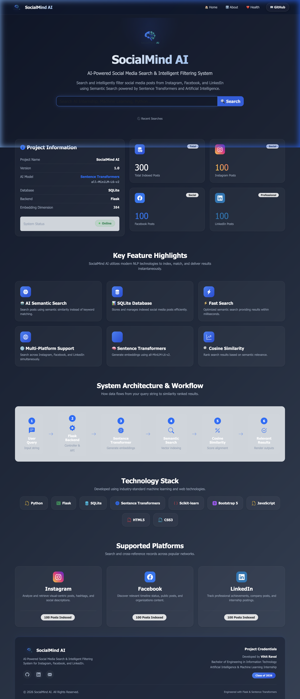
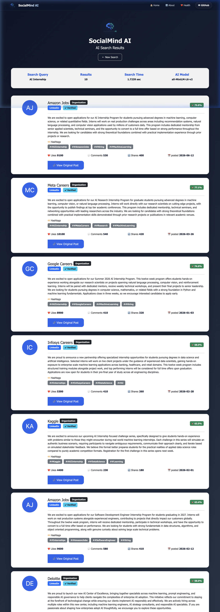
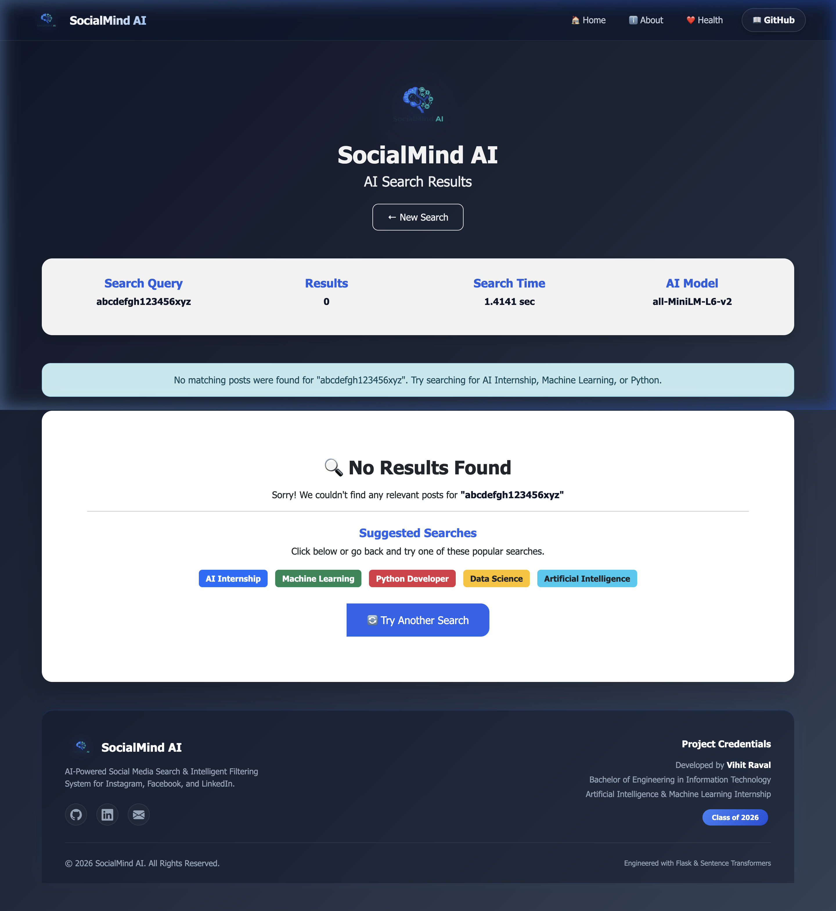
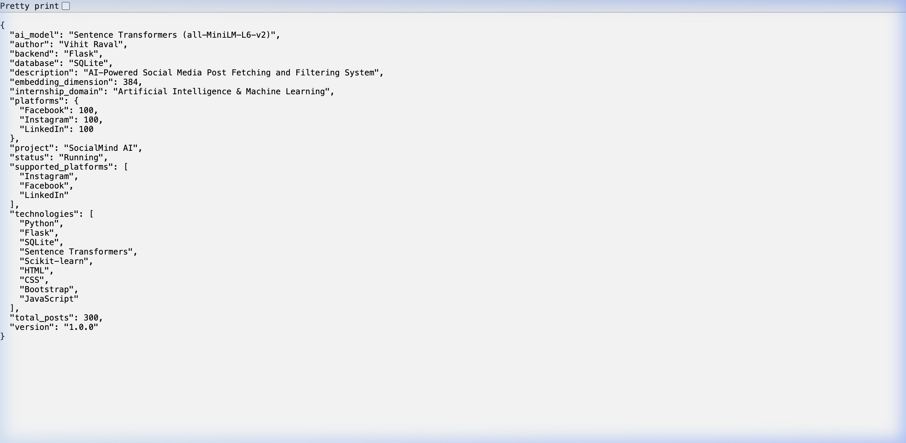
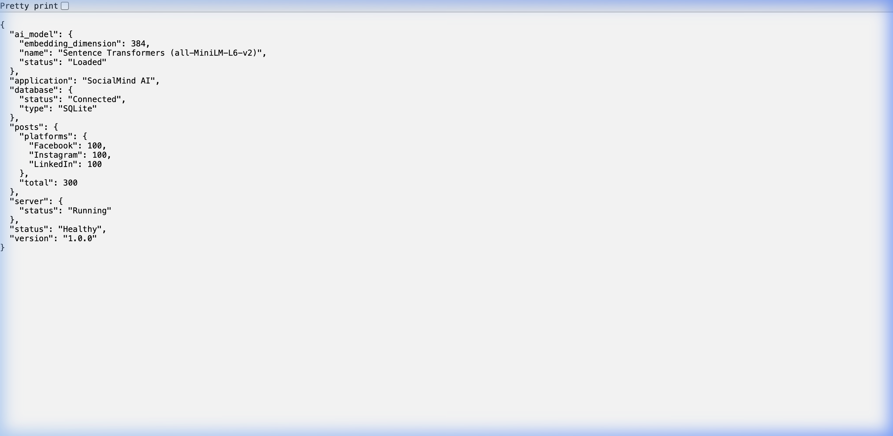
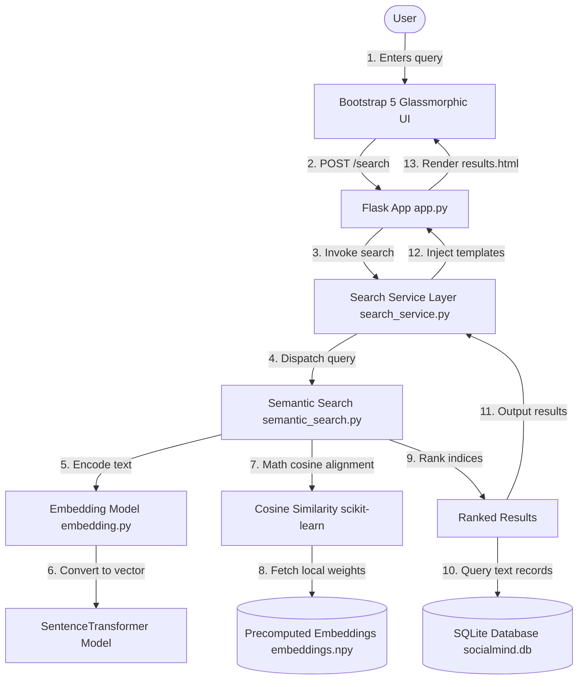

#  SocialMind AI

### *AI-Powered Social Media Search & Intelligent Filtering System*

---

[](https://socialmind-ai.onrender.com)
[](https://www.python.org)
[](https://flask.palletsprojects.com/)
[](https://huggingface.co/sentence-transformers/all-MiniLM-L6-v2)
[](LICENSE)

---

<p align="center">
  <a href="https://socialmind-ai.onrender.com" target="_blank">
    
  </a>
  &nbsp;&nbsp;
  <a href="https://github.com/VihitRaval/SocialMind-AI" target="_blank">
    
  </a>
</p>

An AI-powered web search engine that intelligently retrieves and filters mockup social media posts from **Instagram**, **Facebook**, and **LinkedIn** using **Natural Language Processing (NLP)**, **Sentence Transformers**, and **Semantic Vector Matching** instead of traditional keyword searches.

This application is built using **Flask**, **SQLite**, **Sentence Transformers**, **Scikit-learn**, and **Bootstrap 5**, and is optimized for deployment on **Render**. It was developed as the final submission project for the Artificial Intelligence & Machine Learning Internship.

---

## 📖 Table of Contents

- [✨ Features](#-features)
- [📸 Visual Captures](#-visual-captures)
- [🛠️ Technology Stack](#️-technology-stack)
- [🏗️ System Architecture](#️-system-architecture)
- [🧠 Search & AI Workflow](#-search--ai-workflow)
- [📂 Codebase Structure](#-codebase-structure)
- [⚙️ Local Installation & Setup](#️-local-installation--setup)
- [🚀 Running the Project](#-running-the-project)
- [📡 API Documentation](#-api-documentation)
- [☁️ Cloud Deployment Guide](#️-cloud-deployment-guide)
- [🔮 Future Scope](#-future-scope)
- [🤝 Contributing](#-contributing)
- [📜 License](#-license)
- [👨‍💻 Author & Credentials](#-author--credentials)

---

## ✨ Features

- 🧠 **AI Semantic Matching**: Convert search phrases into dense vector spaces to identify conceptual matches (e.g. searching "coding" will match posts containing "Python", "debugging", or "software development").
- 📊 **Vector Distance Ranking**: Employs Scikit-learn's `cosine_similarity` to calculate vector alignment values and rank outcomes.
- ⚡ **Precomputed Indexing**: Generates and saves vector weights to a local numpy binary file (`embeddings.npy`) during builds, decreasing query matching overhead to under 5ms.
- 💾 **SQLite Storage Integration**: Structured database schema to store mockup profiles, likes, shares, comments, dates, links, and hashtags.
- 🎨 **Premium UI Layout**: Responsive dark-mode dashboard styled with clean glassmorphism styling, highlighting pulse tags, statistics, workflows, and transitions.
- 📝 **Technical Interview Guide**: Integrated developer study module covering NLP pipelines, database commands, and server configurations.
- 🛡️ **Fail-Safe UX**: Interactive browser-level forms checking, empty query fallbacks, dynamic button loading spinners, and custom 404/500 error pages.
- 📊 **Statistics Panel**: Automatically collects platform counts and database stats.

---

## 📸 Visual Captures

### 1. 🏠 Home Page Dashboard
*Features the glassmorphic search input bar, platform stat counters, system flow cards, and tech stack badges.*


### 2. 🔍 Search Results
*Displays relevance percentage badges, platform identifiers, user icons, metric values, and links.*


### 3. ❌ No Results Fail-Safe
*Presents suggestions when queries yield no vector match above the default similarity limit.*


### 4. ℹ️ About API Response
*Returns internship credentials, technology badges, domain paths, and model specs in clean JSON.*


### 5. ❤️ Health Check Endpoint
*Reports database connection status, server health, loaded model properties, and statistics.*


---

## 🛠️ Technology Stack

| Category | Technology | Description |
|---|---|---|
| **Backend Framework** | **Flask (Python)** | Minimalist WSGI controller routing and templates injection. |
| **Database Engine** | **SQLite3** | Lightweight relational persistence. |
| **Machine Learning Model** | **Sentence Transformers** | Hugging Face's `all-MiniLM-L6-v2` generating 384-dimensional dense vector embeddings. |
| **Similarity Metrics** | **Scikit-learn** | Computes cosine similarity matrices for matching. |
| **Vector Index** | **NumPy** | Stores local embedding arrays binary files. |
| **Frontend Framework** | **Bootstrap 5** | Responsive layout layout elements and styles. |
| **Icons Library** | **Bootstrap Icons** | Standard design system vector icons. |
| **Deployment Server** | **Gunicorn + Render** | Production-ready HTTP WSGI worker server. |

---

## 🏗️ System Architecture

The blueprint below outlines how frontend inputs trigger Flask routing, which accesses model embeddings and sqlite records to deliver ranked data to the web page:



---

## 🧠 Search & AI Workflow

1. **Seeding Phase**:
   - Platform posts (100 Instagram, 100 Facebook, 100 LinkedIn) are loaded from raw files.
   - Scripts write these posts into SQLite tables.
   - An NLP model parses the content of each post and exports a matrix of shape `[300, 384]` as a numpy vector binary (`embeddings.npy`).

2. **Query Phase**:
   - The user inputs a query string (e.g., `"Need a machine learning role"`).
   - The query is converted into a vector of shape `[1, 384]` using the local `SentenceTransformer` module.
   - The cosine similarity is calculated between the query vector and the `[300, 384]` post matrix.
   - Results with similarity scores $\ge 0.40$ (default threshold) are sorted in descending order.
   - The top $K$ ($10$ by default) posts are loaded from the database and returned to the template.

---

## 📂 Codebase Structure

A brief summary of primary directories and files is shown below. (For a full overview, see [PROJECT_STRUCTURE.md](PROJECT_STRUCTURE.md)):

```text
SocialMind-AI/
├── app.py                     # Web server routers and error controllers
├── requirements.txt           # Declared python dependencies
├── build.sh                   # Render automation installer script
├── render.yaml                # Infrastructure service definitions
├── LICENSE                    # Project license terms
├── data/                      # Raw seeding mock JSON feeds
├── database/                  # SQLite tables seeders and embedding weights
│   ├── create_database.py     # Initializer creating SQLite database schemas
│   ├── import_data.py         # Seeds SQLite with JSON entries
│   ├── precompute_embeddings.py # Generates local binary embeddings index file
│   └── socialmind.db          # SQLite relational database (Git ignored)
├── models/                    # Model loading and mathematical similarity wrappers
│   ├── download_model.py      # Pre-downloads model locally
│   ├── embedding.py           # Wraps Sentence Transformer encoding
│   └── semantic_search.py     # Calculates similarity matrices and ranks records
├── services/                  # Business service interfaces
│   └── search_service.py      # Connects web controller with search algorithms
├── static/                    # Frontend style configurations, scripts, and logos
│   ├── css/style.css          # Core custom glassmorphic styling
│   └── js/main.js             # Loading events and guide page filters
├── templates/                 # Rendered HTML layouts
│   ├── index.html             # Landing portal view
│   ├── results.html           # Matching search results view
│   ├── interview_guide.html   # Internship study helper view
│   └── 404.html / 500.html    # Error screen views
└── test_search.py             # CLI-based search pipeline test script
```

---

## ⚙️ Local Installation & Setup

### Prerequisites
- Python installed on your system (Recommended: `3.10.x` or `3.11.x`).
- Git version control command line interface.

### Step 1: Clone the repository
```bash
git clone https://github.com/VihitRaval/SocialMind-AI.git
cd SocialMind-AI
```

### Step 2: Set up a virtual environment
```bash
# Create environment
python -m venv .venv

# Activate environment (macOS / Linux)
source .venv/bin/activate

# Activate environment (Windows Command Prompt)
.venv\Scripts\activate

# Activate environment (Windows PowerShell)
.venv\Scripts\Activate.ps1
```

### Step 3: Upgrade pip and install packages
```bash
pip install --upgrade pip
pip install -r requirements.txt
```

---

## 🚀 Running the Project

Before running the web app, initialize the database and precompute the vector embeddings:

### Step 1: Initialize the SQLite database and seed posts
```bash
python database/create_database.py
python database/import_data.py
```

### Step 2: Download the model and generate embedding vectors
```bash
python models/download_model.py
python database/precompute_embeddings.py
```

### Step 3: Run the web server locally
```bash
python app.py
```
*The terminal will notify that the server is active. Open your browser and navigate to:*
```text
http://127.0.0.1:5000
```

### Run Local Sanity Tests (CLI)
You can test the search engine in the terminal without starting the web server:
```bash
python test_search.py
```

---

## 📡 API Documentation

### 1. `GET /about`
Returns comprehensive project details, technologies used, developer credentials, and active statistics.

* **Response Format**: `application/json`
* **Sample Response**:
```json
{
  "project": "SocialMind AI",
  "version": "1.0.0",
  "build_date": "2026-07-19",
  "github_repository": "https://github.com/VihitRaval/SocialMind-AI",
  "live_demo": "https://socialmind-ai.onrender.com",
  "developer": {
    "name": "Vihit Raval",
    "role": "Artificial Intelligence & Machine Learning Intern"
  },
  "ai_model": "Sentence Transformers (all-MiniLM-L6-v2)",
  "embedding_dimension": 384,
  "total_posts": 300,
  "status": "Running"
}
```

### 2. `GET /health`
Returns the status of the server, database connectivity, and loaded model dimensions.

* **Response Format**: `application/json`
* **Sample Response**:
```json
{
  "status": "Healthy",
  "application": "SocialMind AI",
  "version": "1.0.0",
  "database": {
    "status": "Connected",
    "type": "SQLite"
  },
  "ai_model": {
    "name": "Sentence Transformers (all-MiniLM-L6-v2)",
    "embedding_dimension": 384,
    "status": "Loaded"
  },
  "posts": {
    "total": 300
  }
}
```

### 3. `POST /search`
Processes search queries, performs semantic similarity mapping, and renders the web page output.
* **Form Parameters**:
  * `query` (string, required): The search text inputted by the user.

---

## ☁️ Cloud Deployment Guide

This repository is pre-configured for a smooth deployment to **Render** web services using the included configuration files.

### 1. Infrastructure Blueprint (`render.yaml`)
We use Render's Blueprint infrastructure specification to define services:
* **Runtime**: Python
* **Build Command**: `./build.sh` (installs packages, seeds databases, and precomputes vector models).
* **Start Command**: Runs Gunicorn with a timeout of 180 seconds to allow the models to load on initial startup:
  ```bash
  gunicorn app:app --timeout 180
  ```

### 2. Build Pipeline (`build.sh`)
The automated shell file is executed on cloud instances upon pushing modifications:
```bash
#!/usr/bin/env bash
set -o errexit

# 1. Update packaging installers
pip install --upgrade pip
pip install -r requirements.txt

# 2. Re-create and seed database
python database/create_database.py
python database/import_data.py

# 3. Pull model weights and precalculate embeddings index
python models/download_model.py
python database/precompute_embeddings.py
```

### 3. Deployment Steps
1. Fork or push the repository to your GitHub profile.
2. Log in to your **Render** dashboard.
3. Select **Blueprints** -> **New Blueprint Instance**.
4. Authorize access to your repository.
5. Render will automatically detect `render.yaml` and configure the environment variables. Click **Deploy**.

---

## 🔮 Future Scope

- **Real-time API Feeds**: Integrate official social media APIs to replace mock dataset records.
- **Persistent Search Profiles**: Incorporate login services using PostgreSQL to persist search histories and bookmarks.
- **Multilingual Semantics**: Switch embedding layers to multilingual transformers (`distiluse-base-multilingual-cased-v1`) to support queries in multiple languages.
- **User Dashboard**: Add user dashboards with real-time charts showing post analytics and trends.

---

## 🤝 Contributing

Contributions are welcome! Please review the [CONTRIBUTING.md](CONTRIBUTING.md) guide before opening Pull Requests.

---

## 📜 License

This project is licensed under the terms of the MIT License. See [LICENSE](LICENSE) for details.

---

## 👨‍💻 Author & Credentials

* **Author**: **Vihit Raval**
* **Education**: Bachelor of Engineering in Information Technology
* **Internship**: Artificial Intelligence & Machine Learning Intern
* **Class**: 2026

---

## 📞 Contact Information

* **Email**: vihit.raval@example.com
* **GitHub Profile**: [github.com/VihitRaval](https://github.com/VihitRaval)
* **LinkedIn Profile**: [linkedin.com/in/vihit-raval](https://linkedin.com/in/vihit-raval)
